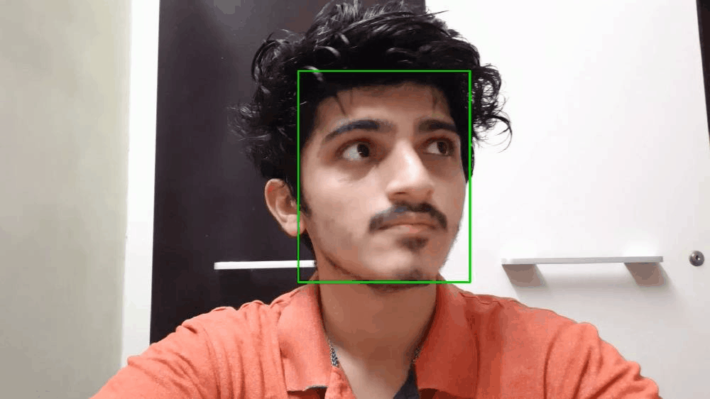
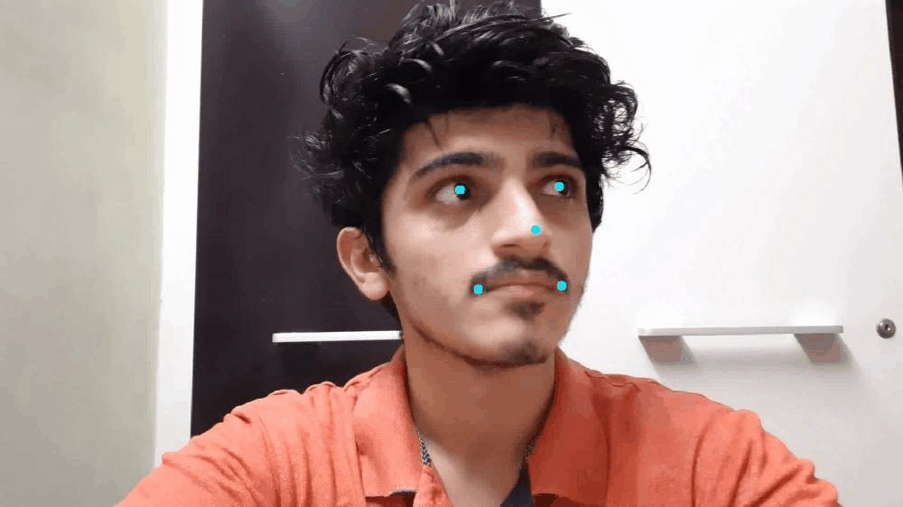
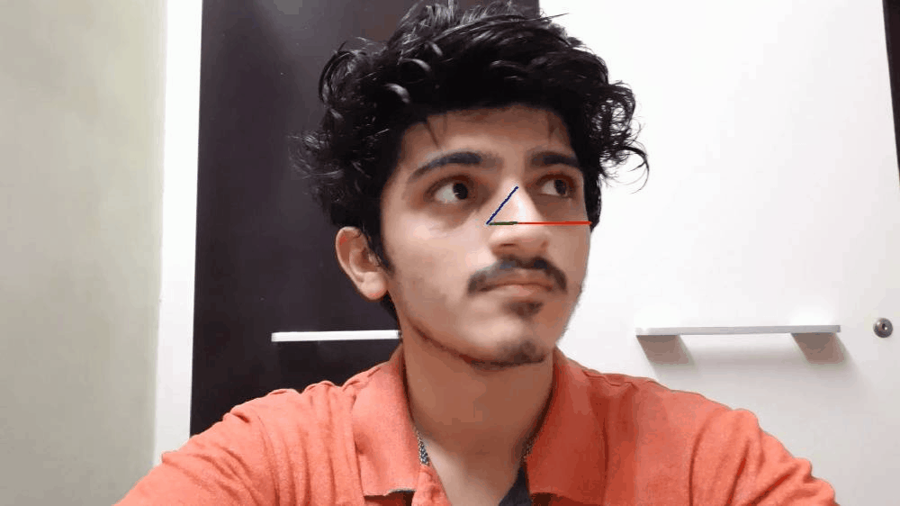
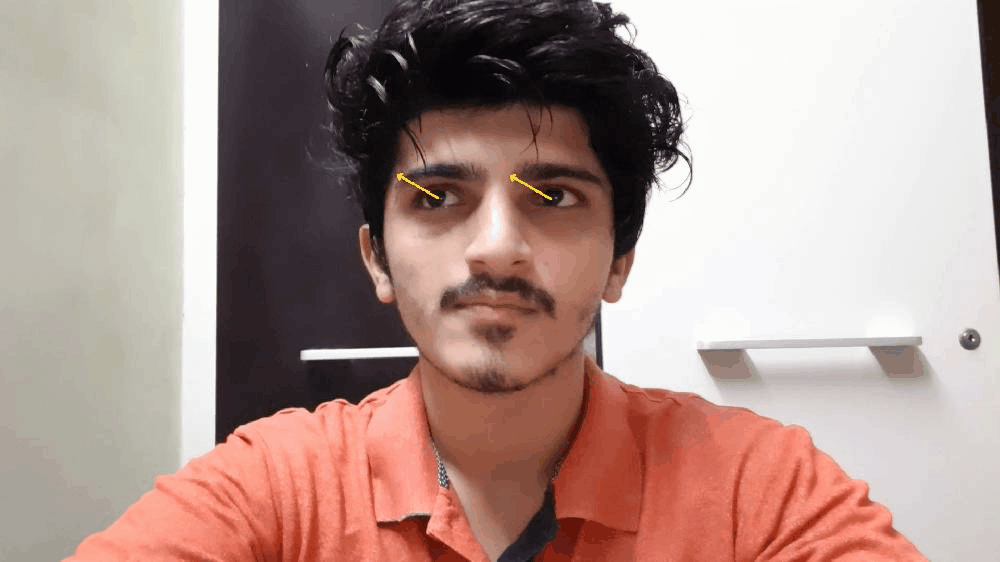

# Computer Pointer Controller

This project is made using the Intel's OpenVINO toolkit. This project enables the user to move the mouse pointer according to the gaze of the user.

## Project Set Up and Installation

Requirements:
* Intel's OpenVINO toolkit
* PyAutoGUI

After installing OpenVINO 

***Step 1:*** Install the requirements

```bash
pip install -r requirements.txt
```

***Step 2:*** Setup OpenVINO for running inference.

```bash
source /opt/intel/openvino/bin/setupvars.sh -pyver {PYTHON_VERSION}
```

## Workflow

The following workflow is used to run inference on the input stream.


## Demo

### To run demo video

```bash
python main.py -input_type video -input_stream bin/demo.mp4 
```

### To run demo cam

```bash
python main.py -input_type cam
```

## Running inferences on separate models

### 1. Face Detection

```bash
python main.py -input_type video -input_stream bin/demo.mp4 -flag fd
```

### 2. Face Landmark Detection

```bash
python main.py -input_type video -input_stream bin/demo.mp4 -flag ld
```

### 3. Head Pose Detection

```bash
python main.py -input_type video -input_stream bin/demo.mp4 -flag hd
```

### 4. Gaze Estimation

```bash
python main.py -input_type video -input_stream bin/demo.mp4 -flag ge
```

| Face Detection        | Facial Landmarks Detection |
|-----------------------|----------------------------|
|  |       |


| Head Pose Detection   | Gaze Estimation       |
|-----------------------|-----------------------|
|  |  |

## Documentation

### Project Structure

```bash
.
├── bin
│   └── demo.mp4
├── LICENSE
├── main.py
├── models
│   └── intel
│       ├── face-detection-adas-binary-0001
│       ├── gaze-estimation-adas-0002
│       ├── head-pose-estimation-adas-0001
│       └── landmarks-regression-retail-0009
├── README.md
├── requirements.txt
├── resources
├── src
│   ├── input_feeder.py
│   ├── models.py
│   └── mouse_controller.py
└── utils
    └── ModelBase.py
```

#### Important Files

* `input_feeder.py`: This file contains a InputFeeder Class which handles the input stream.
* `model.py`: Classes for various models have been written in this file
* `mouse_controller.py`: Contains the MouseController Class which moves the mouse pointer accordingly to the gaze.
* `ModelBase.py`: Contains base Model Class from which the other model class in `models.py` have been inherited.
* `main.py`: This is the main driver file for the entire application.
* `requirements.txt`: All python library dependencies can be installed from this file.

### Command-Line Arguments

```bash
usage: main.py [-h] [-input_stream INPUT_STREAM]
               [-device {CPU,GPU,HETERO:FPGA,CPU,HETERO:MYRIAD,CPU}]
               [-prob_threshold PROB_THRESHOLD] [-flag {fd,ld,hd,ge}]
               -input_type {cam,video,img}

optional arguments:
  -h, --help            show this help message and exit
  -input_stream INPUT_STREAM
                        Give path of input stream if input_type is 'video' or 'img'
  -device {CPU,GPU,HETERO:FPGA,CPU,HETERO:MYRIAD,CPU}
                        State the device on which inference should happen
  -prob_threshold PROB_THRESHOLD
                        Probability threshold for face detections filtering
  -flag {fd,ld,hd,ge}   Choose a particular model only to run inference 
                         fd: Only Face Detection 
                         ld: Only Face Landmark Detection 
                         hd: Only Head Pose Detection 
                         ge: Only Gaze Estimation

required arguments:
  -input_type {cam,video,img}
                        Give the type of input stream
```

## Results

### Loading times of Models

**CPU used: Intel(R) Core(TM) i3-6006U CPU @ 2.00GHz**

|                                                     | FP32 (in ms)        |     FP16 (in ms)    | FP16-INT8 (in ms)   |
|-----------------------------------------------------|---------------------|:-------------------:|---------------------|
| Face Detection Model (Same Model for all scenarios) | 0.2433936595916748  | 0.26357316970825195 | 0.2504093647003174  |
| Face Landmark Detection Model                       | 0.1449739933013916  | 0.6543600559234619  | 0.14608454704284668 |
| Headpose Detection Model                            | 0.14208269119262695 | 0.6201651096343994  | 0.271759033203125   |
| Gaze Estimation Model                               | 0.21468305587768555 | 0.3256380558013916  | 0.3227040767669678  |

## Edge Cases

* The face which is closest to camera will be taken into consideration and the gaze of that particular face will be calculated.
* Even if there is no one in the frame the application will be running.